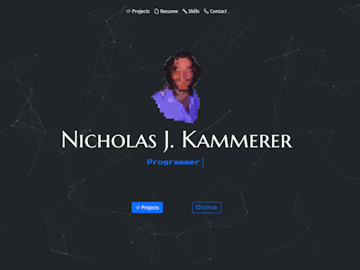

# kammr.com
[Code](https://github.com/nxrada/nkammerer.com)  |  [Live Demo](https://www.nkammerer.com)

## About 
- Portfolio webpage to host my projects.

### Built With

- HTML5
- CSS
- [Bootstrap](https://getbootstrap.com)
- [jQuery](https://jquery.com)

### Acknowledgements
 
- [Iconify](https://iconify.design/) -  Icon library
- [AOS](https://github.com/michalsnik/aos) - Scroll animation library
- [Particles.js](https://github.com/VincentGarreau/particles.js/) - Particle rendering library
- [Typed.js](https://github.com/mattboldt/typed.js/) - Terminal-like typing animation library

## Licensing 

MIT License 2023 nxrada
